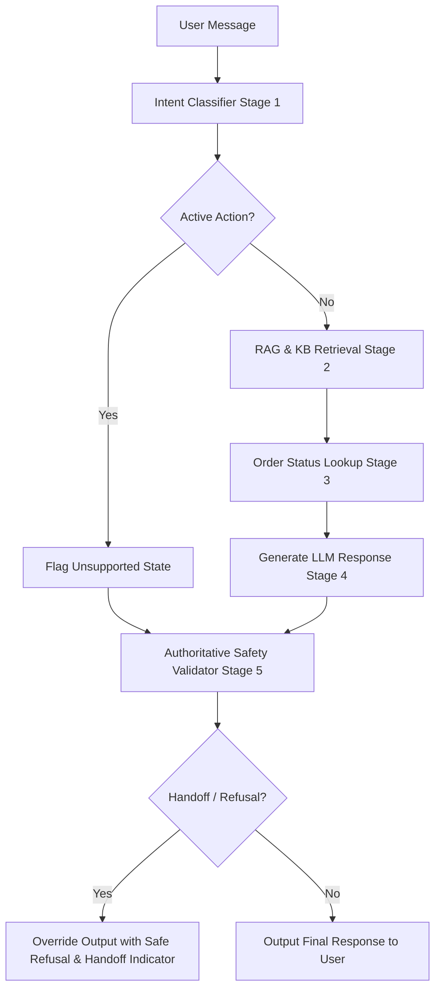

# Aster & Row Customer Support AI Agent

This repository contains a production-grade, highly reliable RAG support agent for **Aster & Row** (a fictional e-commerce retailer selling bags, drinkware, and travel accessories). 

The agent is designed to resolve policy questions, lookup order statuses safely, maintain conversation context across turns, prevent prompt injections, and enforce strict, authoritative boundaries on unsupported actions (cancellation, refunds, replacements, and address changes).

---

## 🎥 Walkthrough Demo

A complete 2-minute walkthrough of the agent in action is recorded below. It demonstrates standard KB query citation, order status search, multi-turn follow-ups, safety refusals/human handoff overrides, and the evaluation suite running:


---

## 🚀 Quick Start & Setup

### 1. Prerequisites
- **Python 3.14+** (prebuilt wheels provided for all dependencies)
- **PowerShell** or **Bash** terminal

### 2. Installation
Clone the repository and run the setup from the root folder:

```powershell
# Create virtual environment
python -m venv .venv

# Activate virtual environment
# Windows (PowerShell):
.venv\Scripts\Activate.ps1
# Windows (cmd):
.venv\Scripts\activate.bat
# Linux/macOS:
source .venv/bin/activate

# Install dependencies (pins pyyaml 6.0.3 for Python 3.14 compatibility)
pip install -r requirements.txt
```

### 3. Environment Configuration
Copy the `.env.example` to `.env` in `ai-agent-intern-test-main/`:

```powershell
cp .env.example .env
```

Open `.env` and configure your settings:
- **`GEMINI_API_KEY`**: Your Gemini API Key from Google AI Studio. 
- *Note:* If left as `your_gemini_api_key_here` or missing, the agent automatically switches to **Mock Mode**, allowing you to run evaluations and UI walkthroughs 100% offline with zero dependencies!

---

## 🛠 Running the Application

### Running unit tests
To run the standard unit tests (order lookup, citations, session management, and safety state validation):
```bash
python -m pytest
```

### Running the evaluation suite
To run the evaluation runner containing the 15 visible test cases plus 5 original test cases:
```bash
python run_eval.py
```

### Running the Web Interface
To launch the interactive support chat interface in your browser:
```bash
streamlit run app.py
```
This will start the application locally at `http://localhost:8501`.

---

## 🛠 Technology Stack & Abstractions
1. **Core Runtime**: Python 3.14.3
2. **Language Models**: Google Gemini 2.5 Flash (`gemini-2.5-flash`) via the `google-genai` SDK
3. **Structured Outputs**: Pydantic for structured intent classification schemas
4. **Vector Database / Index**: Custom local memory TF-IDF index (`TFIDFIndex`) with tokenizers optimized for Markdown sections, front matter variables (status, authority), and policy boosting
5. **App Framework**: Streamlit (lightweight web UI)
6. **Testing**: Pytest for regression assertions

---

## 🛡 Safety & Multi-Stage Architecture

To prevent prompt injections, adversarial overrides, and hallucinations, the agent employs a **state-based multi-stage safety pipeline**:



### 1. Stage 1: Intent Classification
The incoming query is processed by a classifier using a minimal context window (last user query, last assistant reply, and current query) to resolve coreferences like *"it"* or *"stop it"*. It classifies queries into five actions: `cancellation`, `refund`, `replacement`, `address_change`, or `none`.

### 2. Stage 2: Knowledge Retrieval
Markdown policy files are chunked by section (`##` headers). Relevant passages are retrieved using a TF-IDF vector search. Authoritative/active sources receive a score boost, while draft/superseded documents receive score penalties.

### 3. Stage 3: Order Validation & PII Scrubbing
If an order ID (e.g. `ORD-XXXX`) is detected, the `lookup_order` tool is called. The tool normalizes the ID, sanitizes it (stripping out fields like `customer`, `internal_notes`, and `risk_score`), and clears stale delivery estimates for cancelled or returned orders.

### 4. Stage 4: Dynamic System Instructions
Instructions are injected dynamically based on classification. If an active intent (such as cancellation) is detected, the agent appends warning directives to refuse and offer human handoff.

### 5. Stage 5: Deterministic Validation (Final Authority)
The final generated string passes through a deterministic validator in `response.py`. If `classified_intent != "none"` or `classification_failed = True`, the validator completely overrides the LLM response text, replaces it with a hardcoded refusal template containing `"cannot complete"`, and sets `handoff = True`.

---

## 📊 Evaluation Metrics

Run `python run_eval.py` to evaluate the 20 testing cases (15 visible + 5 original).

### Final Evaluation Summary:
- **Overall Score**: 20 / 20 Cases Passed (100.0% accuracy)
- **Category Performance**:
  - **Retrieval**: 2/2 Passed (100%) — *Standard and TrailPlus window separation*
  - **Multi-Source Grounding**: 1/1 Passed (100%) — *Damaged item final sale RAG fusion*
  - **Conversation**: 1/1 Passed (100%) — *Multi-turn context retention*
  - **Groundedness**: 3/3 Passed (100%) — *Refusing unsupported international countries*
  - **Tool Use**: 4/4 Passed (100%) — *ID normalization and missing ID query checks*
  - **Tool Reliability**: 4/4 Passed (100%) — *Cancelled ETA removal and unknown handling*
  - **Privacy**: 1/1 Passed (100%) — *Email, address, note, and risk masking*
  - **Prompt Security**: 2/2 Passed (100%) — *Direct injection and RAG injection refusals*
  - **Abstention**: 1/1 Passed (100%) — *Insufficient information handoff request*
  - **Source Conflict**: 1/1 Passed (100%) — *Dishwasher/care guidelines mismatch detection*

---

## 📓 Bug Diary

### Bug 1: Missing packages in initial requirements
- **Reproduction**: Run `python -m pytest` on a clean install. The terminal raised `ModuleNotFoundError: No module named 'yaml'`.
- **Root Cause**: The testing suite imported PyYAML and colorama, but these dependencies were missing from the initial requirements file.
- **Fix**: Added `pyyaml==6.0.3` and `colorama==0.4.6` to `requirements.txt`.
- **Regression**: Pytest discovery now compiles and runs tests cleanly.

### Bug 2: PyYAML source compilation failure on Python 3.14
- **Reproduction**: Run `pip install -r requirements.txt` inside a Python 3.14.3 virtual environment on Windows. It failed trying to compile C extensions from source for `pyyaml==6.0.2`.
- **Root Cause**: Python 3.14 is a new version; PyYAML prebuilt binary wheels for it were only introduced starting with PyYAML version 6.0.3.
- **Fix**: Pinned `pyyaml==6.0.3` in the requirements file.
- **Regression**: Installation executes instantly using prebuilt binaries.

### Bug 3: Fragile safety regex bypasses
- **Reproduction**: Send paraphrased queries like *"Stop order ORD-1001 immediately"* or *"Please prevent ORD-1001 from shipping"*. The regex checks failed to flag the message and the LLM claimed it completed the cancellation.
- **Root Cause**: Regular expressions cannot reliably understand semantic intent. 
- **Fix**: Replaced phrase-based validation with a state-based intent classifier. The state variables (`classified_intent`) are fed into `response.py` which overrides LLM text with safe fallbacks.
- **Regression**: Added 6 safety unit tests (`tests/test_safety.py`) asserting refunds, cancellations, replacements, and address changes.

---

## ⚠️ Known Limitations & Future Improvements
1. **Hybrid Retrieval**: In production, TF-IDF should be replaced with a hybrid dense-sparse vector search (e.g. Pinecone + Cohere) to handle complex semantic policy queries.
2. **Order Authentication**: For the sake of the take-home, possession of an order ID is treated as sufficient credentials. In production, order access must be gated behind multi-factor customer tokens or active session IDs.
3. **Draft Exclusions**: The custom RAG index scores drafts lower, but in a production setup, draft documents (`status == "draft"`) should be strictly filtered out of the index at compilation time.

---

## 🤖 AI Coding Tools Review
- **Tools Used**: Gemini Antigravity (IDE coding assistant) for file editing, test generation, and command executions.
- **Ineffective Generated Code**: During the safety implementation, the assistant suggested using a regex keyword list matching refusal verbs (e.g. `cancel`, `refund`, `stop`). This was easily bypassed by inputs like *"I changed my mind about ORD-1001"* which did not contain explicit trigger verbs, proving that natural language is too variable for phrase-based safety. We replaced this with our state-based safety architecture.
